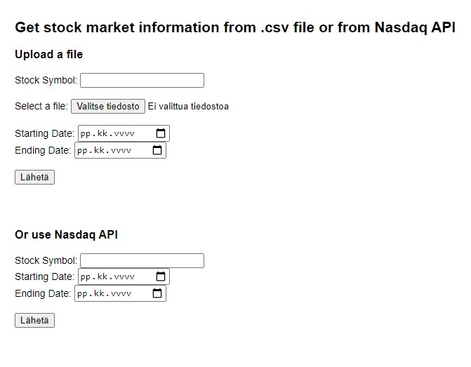
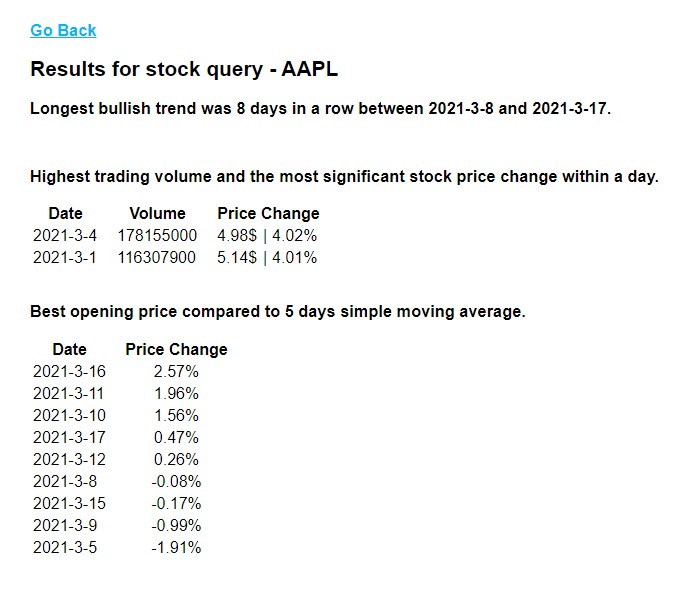

# Stock Query App
> (Minimum Viable Product)

## What is this project

I got as an challenge to do MVP app, from which you can input stock market data and date range, and get market indicators as outcome.

## How to deploy

Clone repository and install dependencies with `npm install`.

Configure connection to your database in *utils/config.js*. The file has configurated for [XAMPP](https://www.apachefriends.org/index.html) with default settings. Remember to **create database** if it doesn't already exist.

Create folder `temp` inside *`public`*. The folder is used for storage location of temporal file while parsing csv-formatted data.

Run software in folder root with `node ./bin/www`.

Open the app on browser - [localhost:3000](localhost:3000).

## How to use

App is simple to use: just fill stock symbol and upload .csv file of the stocks historical data, select starting and ending dates of inquiry. The app then returns results on new page.

If you don't have, or want to use .csv file, inquiry can also be made with *Nasdaq API* option. The app then gets data directly from Nasdaq.

### Accepted data

The app accepts incoming data in following formats:

    Date,Close/Last,Volume,Open,High,Low
    01/01/2001,$102.34,999545613,$99.99,$104,$97.756
    *... and n more rows*

    or

    Date, Close/Last, Volume, Open, High, Low
    01/01/2001, $102.34, 999545613, $99.99, $104, $97.756
    *... and n more rows*

## Bugs, errors and limitations of the app

* Date input does not consider weekends / holidays, so backend may give an error of too short query, even that frontend accepts inputs.

## Updates

As this app is MVP, there is no need to add new features, only possible bug fixes. The project is done for challenge assignment, and such I will propably not make any new updates after returning it. In the future is possibility that I will clone the project as baseline and make updated version.

### Only if I had more time

I would have liked to implement following, but didn't had time for them (maybe I'll update them in the future):

* Queries from input data, instead of from database - Then would be less dependencies and no need for database.

* Middlewares to often used functions.

* try { } catch {} error handling - Software can still crash unrecoverably.

## My way to approach the assignment

As I read the assignment, it became clear that most of the areas were new to me and I had to learn those in order to get functioning product as result. So I decided to first learn required skills and then build the app. I did this because I knew, that if I would be building the app from the start and trying to learn at same time, I would scrap and start again the project *n* times. So I calculated, that learning each required part individually and then build the app, I would not only save time, but energy and my nerves.

## Preview

### index.html

### result.ejs

